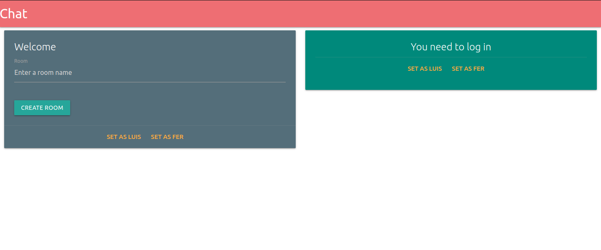
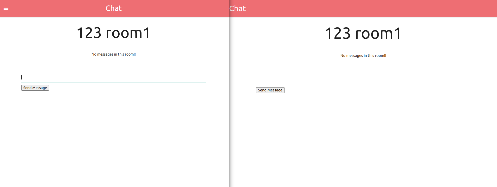
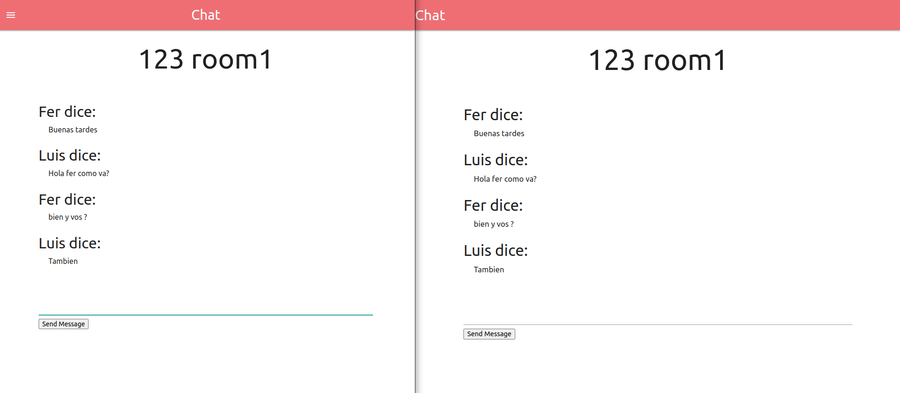

# CHATROOM

### Aplicación cliente-servidor que debe permitir la comunicación entre distintos usuarios en una sala determinada

```
* Usuarios ficticios:

Luis = {
    name: 'Luis',
    email: 'luis@mail.com',
    password: '123',
    id: '123',
};

Fer = {
    name: 'Fer',
    email: 'fer@mail.com',
    password: '123',
    id: '456',
};

* Rooms ficticios:

rooms = [
    {
    name: 'room1',
    _id: '123',
    },
    {
    name: 'room2',
    _id: '456',
    },
];

```

#### Comunicación a través de `socket.io`

### - Pendientes:

    - Auth de usuario (está estático)
    - Creación dinámica de Room (está estático)
    - Testing.

---

## Capturas:

<p align="center">

</p>

<p align="center">

</p>

<p align="center">

</p>

---

##  Cómo probarlo localmente

- Puede clonar el proyecto en alguna carpeta o descargarlo en un archivo comprimido.
- Necesitará tener instalado `Node`.
- Puede usar npm o pnpm, por preferencia en base a rendimiento elijo `pnpm` ( [instalar pnpm ](https://www.npmjs.com/package/pnpm))
- Una vez clonado o descargado el proyecto puede usar los siguientes scripts tanto para el cliente como el servidor:

### `npm install`

Para instalar todos las dependencias que utiliza el proyecto.

###  Modo Development

### `npm o pnpm dev`

Para correr la app en modo desarrollo.

Para poder verlo en el navegador, abrir: [http://localhost:5173/](http://localhost:5173/).

---

##  Desarrollado por:

- Gerez Martinez Luis [](https://www.linkedin.com/in/luisgerezm/)
